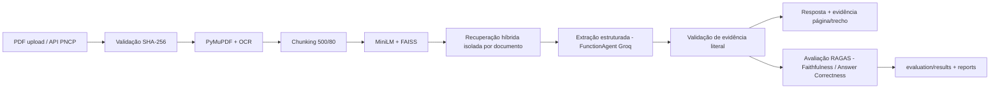

# Agente Autônomo para Análise de Editais de Licitação

Projeto do Módulo 7 (PPI/SiDi): agente RAG com extração estruturada para triagem de editais de licitação públicos, com recuperação híbrida, benchmark por campo, avaliação **RAGAS** (Faithfulness e Answer Correctness) e reprodutibilidade end-to-end (`.venv` + `requirements.txt` fixado).

**Atualizado em 07/08/2026** com o branch `rag-improvements`: métricas RAGAS implementadas e executadas (`evaluation/ragas_metrics.py`, `evaluation/run_experiments.py`), além de auditoria de decisões do pipeline de produção.

Este README é o documento de referência do projeto — um avaliador deve conseguir entender, instalar e executar tudo lendo apenas este arquivo.

## 1. Introdução `[E1]`

### 1.1 Título

Agente Autônomo para Análise de Editais de Licitação

### 1.2 Equipe

| Nome         | Papel principal                         | Contribuição principal                                                              |
| ------------ | --------------------------------------- | ------------------------------------------------------------------------------------- |
| Danielle     | Líder de equipe                        | Coordena planejamento, comunicação com o instrutor e divisão de tarefas            |
| Carol        | Líder de dados                         | Coleta, limpeza e EDA (área: Ciência de Dados)                                      |
| André       | Líder de parsing documental            | Extração de texto de PDF, OCR, chunking e rastreamento de evidências               |
| Rayson       | Analista de parsing documental          | Suporte à extração de texto de PDF, OCR, chunking e rastreamento de evidências    |
| André       | Líder de baseline                      | Implementação metadata-only e regex; normalização de datas, valores e modalidades |
| André       | Líder de agentes                       | LangGraph/LlamaIndex, ferramentas, prompts e extração estruturada                   |
| David        | Líder de avaliação                   | Benchmark anotado, métricas, análise de erros, custo e alucinação                 |
| Carol / Dani | Líder de documentação/apresentação | README, slides, roteiro da demo e defesa oral                                         |

Tamanho da equipe: 6 integrantes (dentro do intervalo de 6 a 7 alunos).

### 1.3 Contexto e motivação

Empresas que participam de licitações precisam ler e interpretar editais extensos em pouco tempo. Informações essenciais — prazos, modalidade, valor estimado, critérios de julgamento, exigências de habilitação e documentos anexos — costumam aparecer de forma distribuída em PDFs, anexos e metadados oficiais. A leitura manual é demorada, sujeita a erro e dificulta a triagem de oportunidades.

O projeto propõe um agente autônomo capaz de monitorar editais públicos, coletar documentos vinculados, extrair pontos críticos e gerar um resumo executivo acompanhado de checklist de habilitação, priorizando rastreabilidade: cada campo extraído deve estar associado a uma evidência literal (documento, página e trecho).

### 1.4 Problema / pergunta de pesquisa

É possível construir um agente que extraia campos críticos de editais de licitação (prazo, valor, modalidade) com precisão ≥ 80%, usando arquitetura híbrida de recuperação semântica/lexical/estrutural e agente estrito com evidência, superando um baseline baseado apenas em regex?

### 1.5 Hipótese

Uma arquitetura híbrida, combinando metadados oficiais, baseline de regras e agente com busca semântica e extração estruturada, pode superar uma abordagem baseada apenas em regex na extração de campos críticos de editais, mantendo custo e taxa de alucinação factual controlados (avaliada via RAGAS).

### 1.6 Objetivos

- Coletar amostra de editais e metadados a partir de APIs públicas do Compras.gov.br/PNCP (conector opcional implementado).
- Construir um benchmark piloto com 10 editais anotados manualmente (30 referências humanas validadas; split fixo 7 desenvolvimento / 3 teste).
- Implementar baselines (regex e LLM sem recuperação) e o agente RAG com recuperação híbrida.
- Implementar e executar métricas RAGAS (Faithfulness, Answer Correctness) sobre a configuração experimental congelada.
- Auditar o pipeline de produção (9 campos × documentos) com taxonomia de decisão e evidência literal.
- Medir acurácia por campo, F1, alucinação factual (`unsupported_claim_rate`), custo e latência.
- Gerar documentação reproduzível (README, dependências fixadas, relatórios).

## 2. Dados

### 2.1 Fonte e licença `[E1]`

- **Fonte:** Compras.gov.br / Portal Nacional de Contratações Públicas (PNCP) — APIs públicas e documentos vinculados.
- **Licença:** Licença Aberta (dados públicos).
- **Acesso:** sem autenticação para metadados; documentos PDF/XML conforme disponibilidade.
- **Status atual:** ingestão via upload manual de PDF funcionando (19 PDFs indexados); coleta opcional via PNCP implementada em `scripts/collect_pncp.py` (`search` e `download`, com registro de URL oficial, data, identificadores PNCP e SHA-256), pendente de validação em rede no ambiente de dev. Os PDFs atuais não foram atribuídos retroativamente ao PNCP/Compras.gov.br.

### 2.2 Volume e formato `[E1]`

- Formato: JSON (metadados) e PDF (editais e anexos).
- Corpus operacional: 19 PDFs / 1.064 chunks e vetores no índice FAISS.
- Benchmark piloto congelado: 10 editais anotados manualmente (30 referências humanas), split fixo de 7 documentos para desenvolvimento e 3 para teste.

### 2.3 Variáveis principais `[E1]`

O sistema extrai e audita **9 campos por documento** (`services/extraction_service.py`):

| Campo                         | Tipo        | Descrição                                                       |
| ----------------------------- | ----------- | ----------------------------------------------------------------- |
| Objeto                        | texto       | Descrição do objeto licitado                                    |
| Modalidade                    | categórica | Ex.: pregão, concorrência, leilão, credenciamento              |
| Valor estimado                | numérica   | Valor global, máximo, de referência, orçamentário ou sigiloso |
| Prazo de validade da proposta | data        | Validade da proposta                                              |
| Órgão responsável          | texto       | Órgão/entidade responsável                                     |
| UF                            | categórica | UF do órgão ou da execução                                    |
| Critério de julgamento       | categórica | Menor preço, maior lance, técnica e preço, etc.                |
| Prazo de execução           | data        | Prazo de execução do contrato/objeto                            |
| Requisitos de habilitação   | texto       | Documentos e exigências                                          |

### 2.4 Riscos de dados `[E1]`

- PDF escaneado (exige OCR) e anexos extensos.
- Divergência entre metadados oficiais e texto do edital (deve ser registrada, não ocultada).
- Campos ausentes ou sigilosos (tratar como indisponibilidade, não como erro do modelo).
- Valores variáveis por item/lote (não calcular total artificial).
- Desbalanceamento por modalidade/órgão na amostra.

### 2.5 Pré-processamento aplicado `[E2]`

Etapas implementadas no código:

1. Validação do PDF (SHA-256, duplicidade, limite de tamanho) e extração de texto com PyMuPDF, fallback para OCR (Tesseract) em páginas sem texto nativo.
2. Chunking configurável (produção: 500 palavras, overlap 80; experimento congelado: `chunk500_overlap50_topk3`).
3. Embeddings (`all-MiniLM-L6-v2`, snapshot local offline por padrão) e indexação FAISS com persistência (`vector_index.faiss` + `chunks_metadata.json`).
4. **Recuperação híbrida** isolada por `document_id`: `0,40 × similaridade densa + 0,25 × BM25 + 0,25 × correspondência de campo/título + 0,10 × posição/estrutura`, com expansão de seção, reranking local e rejeição de evidência de outro documento (`services/retrieval.py`, `services/retrieval_pipeline.py`).
5. Extração estruturada dos 9 campos com validação de evidência literal e ontologia de prazos (validade, entrega, execução, vigência, assinatura, pagamento, recurso, impugnação, credenciamento) — `services/deadline_ontology.py`.

Estados especiais de decisão (`NOT_APPLICABLE`, `ACTUALLY_ABSENT`, `FIELD_CONFIDENTIAL`, `FIELD_VARIABLE_BY_ITEM`) não são convertidos artificialmente em `FOUND`. Equivalência de valores para comparação com gabarito usa normalização literal (`services/evidence.normalize_literal`).

### 2.6 Ética e privacidade `[E1, revisar na E2]`

- Dados públicos de compras governamentais; sem PII dos cidadãos.
- Licença aberta compatível com uso acadêmico.
- O sistema é apoio à triagem, não substituto de análise jurídica/profissional.

## 3. Metodologia

### 3.1 Abordagem `[E1]`

Abordagem híbrida de **agente RAG com extração estruturada (function calling)**: recuperação densa+lexical+estrutural sobre o índice, agente estrito (FunctionAgent do LlamaIndex via Groq) que responde somente com base no contexto recuperado e cita evidência literal. Comparação contra baselines de regras (regex) e LLM sem recuperação. Avaliação por campo e por RAGAS.

### 3.2 Stack técnica `[E1]`

- Python 3.11+ (`requirements.txt` fixa versões).
- Flask (API), LlamaIndex + Groq (`openai/gpt-oss-120b`), FAISS, sentence-transformers, PyMuPDF, Tesseract, **RAGAS 0.4.3**.
- Recuperação híbrida própria (FAISS + BM25 + sinais estruturais + expansão de seção).
- Gerenciamento por `.venv` + `pip` (`requirements.txt`); sem Docker/CI neste branch.

### 3.3 Baselines `[E1]`

- Baseline A — **regex:** extrai datas, valores e termos recorrentes do texto (`evaluation/baselines.py`).
- Baseline B — **LLM sem recuperação (`llm_no_retrieval`):** responde sem contexto documental.
- Status: **implementados** no pacote `evaluation/`, com normalização e equivalência compartilhadas.

### 3.4 Pipeline `[E2]`



### 3.5 Modelos comparados `[E2]`

Baseline regex, baseline LLM sem recuperação e agente RAG. Grid experimental RAG: chunk 300/500/800 × overlap 50/80 × top-k 3/5 (12 configurações). Seleção exclusivamente no desenvolvimento (`chunk500_overlap50_topk3`), congelada por hash (`evaluation/results/selected_config.json`) antes do teste. Orquestração pelo runner `python evaluation/run_experiments.py` (pacote `evaluation/`), com checkpoint retomável.

### 3.6 Protocolo de validação `[E1]`

- Benchmark congelado: 10 editais, 30 referências humanas validadas (valor estimado, modalidade e prazo/validade da proposta), split fixo 7/3, seed 42.
- RAGAS: `Faithfulness` sempre; `Answer Correctness` somente quando há referência humana validada; contexto do juiz limitado a 12.000 caracteres priorizando o chunk da evidência; uma amostra por checkpoint para respeitar limites de TPM/TPD do plano gratuito (`evaluation/ragas_metrics.py`).
- Comandos: `python evaluation/run_experiments.py --split development`, depois `--split test`, e `python evaluation/generate_reports.py`.

O sistema não treina modelos — a avaliação é sobre recuperação + geração (RAGAS e benchmark por campo).

### 3.7 Métricas e critérios de sucesso `[E1: planejados; E2: aplicados]`

| Métrica                                          | Meta                            |
| ------------------------------------------------- | ------------------------------- |
| Faithfulness (RAGAS)                              | ≥ 0,85                         |
| Answer Correctness (RAGAS)                        | ≥ 0,80                         |
| Alucinação factual (`unsupported_claim_rate`) | minimizar; ideal ≤ 10%         |
| Acurácia por campo (prazo, valor, modalidade)    | ≥ 80%                          |
| F1 por categoria / checklist de habilitação     | reportar                        |
| Custo por edital (tokens/calls)                   | reportar                        |
| Latência                                         | reportar média/mediana         |
| `reference_mismatch_rate`                       | reportar (não é alucinação) |

Definição das métricas de alucinação: `unsupported_claim_rate` mede afirmações factuais sem suporte documental (evidência inválida → 1; evidência válida com RAGAS → `1 − Faithfulness`). `hallucination_rate` foi preservada como alias por compatibilidade. `reference_mismatch_rate` mede respostas não literalmente equivalentes ao gabarito humano — divergência textual, não alucinação.

## 4. Cronograma `[E1: planejado; E2: status]`

| Semana | Período         | Marco / atividade prevista                                | Status (E2)                                                             |
| ------ | ---------------- | --------------------------------------------------------- | ----------------------------------------------------------------------- |
| 1      | 29/mai – 05/jun | Pré-especificação + aquisição de dados + EDA inicial | Concluída — especificação e EDA inicial                             |
| 2      | 06–12/jun       | EDA aprofundada + definição de features                 | Concluída — variáveis e schema de campos definidos                   |
| 3      | 13–19/jun       | Baseline trivial e linha de base de métricas             | Concluída — baselines regex/LLM e normalização                      |
| 4      | 20–26/jun       | Modelo principal v1 + experimentos iniciais               | Concluída — aplicação RAG (upload/query/chunks/status)              |
| 5      | 27/jun – 03/jul | Entrega 1 (30/jun) + refinamento pós-feedback            | Concluída — proposta entregue                                         |
| 6      | 04–10/jul       | Tuning + ablation studies                                 | Concluída (parcial) — grid experimental e seleção de configuração |
| 7      | 11–17/jul       | Análise de erros + fairness (se aplicável)              | Concluída — análise de erros; fairness n/a                           |
| 8      | 18–24/jul       | Documentação final + experimento original RAGAS (22/07) | Concluída — README, benchmark, avaliação por campo                  |
| 9      | 25jul–07/ago    | Entrega 2 (07/ago) — Seminário + slides + defesa        | Concluída — Entrega 2, seminário e reavaliação RAGAS (07/08)       |

**Desvios (E2):** a ingestão via API PNCP e a execução do benchmark original (50 editais) não puderam ser validadas em rede — a API esteve inacessível no ambiente de dev. Como compensação, o foco da entrega final migrou para a **avaliação RAGAS**: métricas implementadas e executadas sobre a configuração congelada (`evaluation/results/rerun_current_2026-08-07_test/`), além da auditoria completa do pipeline de produção (171 decisões, seção 5).

## 5. Resultados `[E2]`

### 5.1 Métricas obtidas

**Auditoria do pipeline de produção** (07/08/2026): 19 documentos × 9 campos = **171 decisões** (`output/relatorio_rag_decisoes_auditaveis_2026-08-07.md`).

| Indicador                             |                         Resultado |
| ------------------------------------- | --------------------------------: |
| Respostas externas encontradas        |                 140/171 — 81,87% |
| Decisões estritamente corretas       |                 167/171 — 97,66% |
| Casos GOLDEN preservados              |             46/46 (0 regressões) |
| `UNRESOLVED` / falsos positivos     |                             0 / 0 |
| Evidências cruzadas entre documentos |                                 0 |
| Recall@1 / @3 / @5 / @10              | 65,22% / 84,78% / 93,48% / 95,65% |

Os 4 casos de valor variável por item/lote permanecem fora da fórmula estrita; o sistema não soma valores nem cria total global inexistente.

**Reavaliação RAGAS** (07/08/2026) — configuração congelada `chunk500_overlap50_topk3`, 3 documentos do teste × 3 campos = 9 perguntas:

| Métrica                                          | 22/07/2026   |   07/08/2026 |  Variação |
| ------------------------------------------------- | ------------ | -----------: | ----------: |
| Respostas avaliadas                               | 2/9          |          3/9 |          +1 |
| Cobertura                                         | 22,22%       |       33,33% | +11,11 p.p. |
| Faithfulness                                      | 1,0000 (n=2) | 1,0000 (n=3) |           0 |
| Answer Correctness                                | 0,8469 (n=2) | 0,9578 (n=3) |     +0,1109 |
| `unsupported_claim_rate` (alucinação factual) | 0%           |           0% |           0 |
| `reference_mismatch_rate`                       | 50%          |       66,67% | +16,67 p.p. |

Respostas avaliadas: `edital609.pdf` (modalidade: Leilão × leilão eletrônico, Faithfulness 1,0, Correctness 0,9429), `EDITAL_DE_CREDENCIAMENTO_004.2025_assinado.pdf` (modalidade: Credenciamento, 1,0 / 0,9304) e `EDITAL_CC006.pdf` (modalidade: Concorrência eletrônica, 1,0 / 1,0). As médias RAGAS são condicionais às respostas produzidas; a amostra efetiva (n=3) continua pequena.

Custo da rodada: 6.601 tokens (5.926 entrada / 675 saída), custo teórico US$ 0,00129390, latência média 23,85 s por pergunta.

A tabela de acurácia por campo sobre 50 editais permanece **pendente** (rede/PNCP), mas as tabelas de comparação e agregados são geradas por `python evaluation/run_experiments.py` + `python evaluation/generate_reports.py` (ex.: `evaluation/results/rerun_current_2026-08-07_test/global_summary.json`).

### 5.2 Gráficos relevantes

As figuras existentes em `docs/figs/` registram o experimento original de 22/07/2026 (históricas). A reavaliação de 07/08 gera relatórios de comparação e CSVs agregados em `evaluation/results/rerun_current_2026-08-07_test/` (comparison_report.md, results_by_document.csv, results_by_field.csv).

### 5.3 Análise de erros

- **Cobertura baixa:** na reavaliação, 6 dos 9 campos não foram respondidos (3 prazos e 3 valores) — informação não encontrada nos trechos. Melhorar cobertura sem relaxar a validação literal é o principal próximo passo.
- **Divergência textual ≠ alucinação:** `Leilão` × `leilão eletrônico` e `Procedimento: Credenciamento` × `credenciamento` têm evidência válida e Faithfulness 1,0; são `reference_mismatch`, não alucinação factual.
- **PDFs escaneados** dependem de OCR (Tesseract); a qualidade varia com a qualidade da página.
- **Valores sigilosos e variáveis por item** possuem estados próprios (`FIELD_CONFIDENTIAL`, `FIELD_VARIABLE_BY_ITEM`) e não são promovidos artificialmente.
- **Conflitos metadado×texto** são registrados (RN-02) e são o principal caso de erro esperado em editais reais.

### 5.4 Comparação com a hipótese

A hipótese é **confirmada no recorte avaliado** segundo a métrica corrigida: Faithfulness 1,0 (≥ 0,85), Answer Correctness 0,9578 (≥ 0,80) e alucinação factual 0% (≤ 10%). Ressalvas: a definição de alucinação foi ajustada após a observação do teste (risco de ajuste pós-hoc) e deve ser congelada e validada em novo holdout; a comparação quantitativa por campo contra o baseline regex (50 editais) continua pendente de execução com rede.

## 6. Conclusão `[E2]`

### 6.1 Principais achados

- Pipeline híbrido de produção auditado: 140/171 respostas encontradas (81,87%), 167/171 decisões estritamente corretas (97,66%), 0 regressões GOLDEN, 0 falsos positivos.
- Métricas **RAGAS implementadas e executadas** (`evaluation/ragas_metrics.py`): Faithfulness 1,0 e Answer Correctness 0,9578 na reavaliação de 07/08, com separação explícita entre alucinação factual (`unsupported_claim_rate`) e divergência textual (`reference_mismatch_rate`).
- Recuperação híbrida (densa + BM25 + estrutural + expansão de seção) com isolamento obrigatório por `document_id` e evidência literal.
- Ontologia de prazos e taxonomia de decisão (FOUND, confidencial, não aplicável, ausente, variável por item) reduzem falsos positivos e respostas inventadas.
- Repro­dutibilidade: `.venv` + `requirements.txt` fixado, checkpoint retomável, seed 42 e 160 testes automatizados.

### 6.2 Limitações

- Reavaliação RAGAS pequena: 3 documentos, 9 perguntas e 3 respostas avaliadas — cobertura 33,33%.
- Definição de alucinação corrigida após observar o teste; precisa de congelamento prévio e novo holdout.
- Pipeline experimental congelado ≠ pipeline híbrido de produção (objetivos diferentes; não combinar em uma única média).
- API PNCP sem validação em rede; PDFs não atribuídos retroativamente ao PNCP/Compras.gov.br.
- Dependência de serviço externo (Groq): disponibilidade, chaves e limites de taxa.
- Sem Docker/CI e sem multi-agente comparativo neste branch.

### 6.3 Trabalhos futuros

- Congelar as definições de métricas e avaliar em novo holdout/corpus ampliado.
- Submeter o pipeline híbrido de produção ao mesmo protocolo RAGAS do experimento congelado.
- Melhorar a cobertura experimental (3/9) sem relaxar a validação literal.
- Executar o benchmark por campo (50 editais) quando a API PNCP estiver acessível.
- Ingestão automática via PNCP na aplicação (hoje opcional via script).

### 6.4 Aprendizados da equipe

- Bloqueios externos (rede/API) exigem plano B desde o início — dados de exemplo e pipeline offline ajudaram a destravar o desenvolvimento.
- Determinismo e reprodutibilidade (seed fixa, checkpoints, hash de configuração selecionada) pagam dividendos na avaliação e na revisão.
- Registrar lacunas/riscos de forma explícita (conflito metadado×texto, campos ausentes) é tão importante quanto a acurácia.
- Separar conceitos de qualidade (alucinação factual vs. divergência de gabarito) evita conclusões equivocadas sobre o modelo.

## 7. Reprodutibilidade `[E2]`

### 7.1 Requisitos

- Python 3.11+ (versões fixadas em `requirements.txt`).
- Ambiente virtual `.venv` + `pip` (recomendado; ver 7.2).
- Dependências principais: Flask 3.1.2, llama-index 0.14.6, faiss-cpu 1.12.0, sentence-transformers 5.1.2, ragas 0.4.3, groq 0.33.0, PyMuPDF 1.26.5, pytesseract 0.3.13.
- Sistema operacional testado: Windows (o Tesseract pode exigir `TESSERACT_CMD`).
- Modelo de embeddings offline por padrão (`EMBEDDING_OFFLINE=true`); validar cache com `python scripts/prepare_embedding_model.py --offline-check`.
- Semente global fixa: `42` (`BENCHMARK_SEED`).

### 7.2 Instalação

```bash
# Clonar o repositório
git clone https://github.com/Davidamascen07/Projeto-licitao.git
cd Projeto-licitacao

# Ambiente isolado com venv (Windows PowerShell)
py -m venv .venv
.\.venv\Scripts\Activate.ps1
python -m pip install --upgrade pip
python -m pip install -r requirements.txt

# Variáveis de ambiente (veja .env.example)
Copy-Item .env.example .env
# Preencha GROQCLOUD_API_KEY (e opcionalmente GROQCLOUD_API_KEYS / _2 / _3)
```

### 7.3 Obter os dados

```bash
# Validar/baixar o snapshot local do modelo de embeddings
python scripts/prepare_embedding_model.py --offline-check

# Coleta opcional via PNCP (requer internet)
python scripts/collect_pncp.py search --start 20260701 --end 20260702 --modality 6 --page 1 --uf CE
python scripts/collect_pncp.py download --cnpj 12345678000199 --year 2026 --sequence 7

# Revisão humana das referências do benchmark (10 editais, split 7/3)
python scripts/review_benchmark.py --report
python scripts/review_benchmark.py
```

O corpus operacional (19 PDFs) e o benchmark congelado (`evaluation/benchmark.json`) já vêm no repositório.

### 7.4 Executar o pipeline

```bash
# Iniciar o servidor (carrega/cria o índice FAISS)
python app.py
# Acesse http://127.0.0.1:5000
```

### 7.5 Executar os experimentos RAGAS

```bash
# Rodar baselines + configurações RAG no split de desenvolvimento (seleciona configuração)
python evaluation/run_experiments.py --benchmark evaluation/benchmark.json --split development
# Rodar o split de teste com a configuração congelada
python evaluation/run_experiments.py --benchmark evaluation/benchmark.json --split test
# Gerar relatórios consolidados
python evaluation/generate_reports.py
```

O runner usa checkpoint retomável e avalia RAGAS (Faithfulness e, quando há referência humana, Answer Correctness). Para diagnóstico sem RAGAS, use `--skip-ragas`.

### 7.6 Rodar os testes

```bash
# pytest — 160 testes aprovados (verificado em 07/08/2026)
python -m pytest -q tests
```

### 7.7 Artefatos gerados

- `vector_index.faiss` — índice vetorial FAISS.
- `chunks_metadata.json` — metadados dos chunks.
- `data/documents_manifest.json` — manifesto dos documentos.
- `evaluation/benchmark.json` — benchmark congelado (10 editais, referências humanas).
- `evaluation/results/` — resultados experimentais por split e reavaliação RAGAS (`rerun_current_2026-08-07_test/`).
- `output/` — auditoria das 171 decisões (relatório `.md`, `.json` e `.csv`).
- `docs/` — relatórios: `experimental_results.md`, `hybrid_retrieval.md`, `implementation_report.md`, `limitations.md`.
- `requirements.txt` — dependências fixadas.
